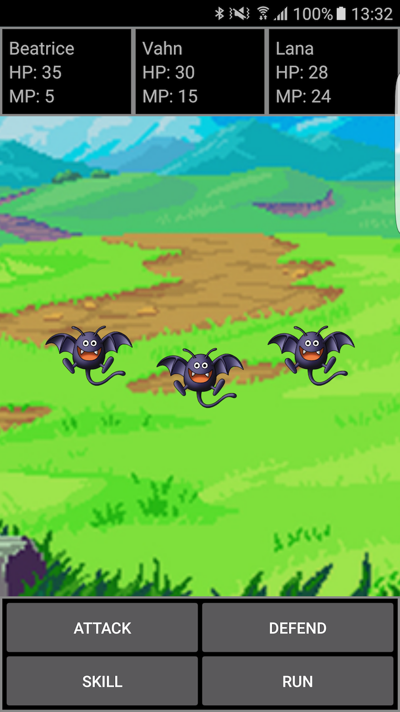
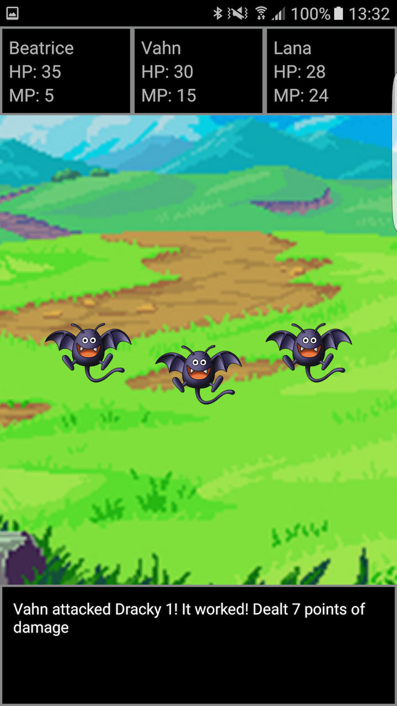

# Turn Based Battle System

A Dragon Quest-like turn based battle system made in Kotlin (Android), for, uhhh, fun. There are all
 the basic stuff from JRPG battles: you can attack, defend, use magic, or run from the battle.
 You select your commands and then they are executed based on each character's speed. The "run"
 command is a little broken because you can select it for every playable character, so you're almost
 guaranteed to run away from the battle if you wish so.

   

## About the code
I tried to separate the code in modules to make them as reusable as possible. There is an `Engine`
that controls the battle flow - selecting commands, executing, checking if the battle is over -
by executing `Actions` like `SelectCommandsAction`, `ExecuteCommandsAction` and so on.
It's built using a faux-MVP architecture. There is a `UiInteractor` that acts like a Presenter,
taking an object that implements the `View` interface and calling its methods when necessary.
I made it this way so I could implement a different user interface if I wanted. A command line
interface is, in theory, totally feasible using the current structure (removing the Android
dependencies, of course). The final result relies way too much on callbacks, by right now it works.
I guess it will be fun to rewrite everything using coroutines (https://github.com/kotlin/kotlinx.coroutines)!

## About the resources
I basically googled "free rpg sounds' for the audios, and the enemies are Drackies from Dragon Quest
(image taken from the DQ Wiki).